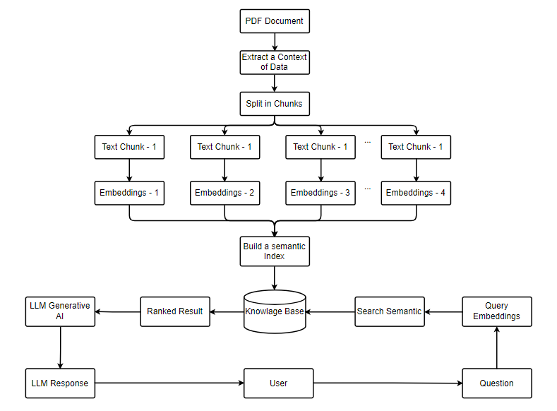
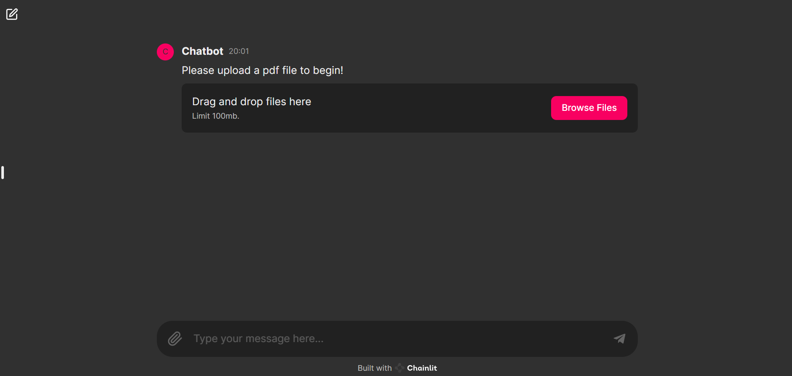

# PDF Chatbot with LangChain and Chainlit

This project implements a conversational AI chatbot that interacts with users by processing and understanding PDF documents. It leverages the power of LangChain, PyPDF2, Chainlit, and GROQ language models to provide an efficient and interactive experience.

## Flow of apps



Here is a flowchart for creating a Retrieval-Augmented Generation (RAG) app:

**Steps:**

1. **User Question:** The user asks a question.
2. **Query Preprocessing:** The question is processed and converted into a format suitable for searching.
3. **Retrieve Relevant Documents:** The system retrieves relevant documents from a database or external sources.
4. **Document Chunks:** Documents are split into smaller chunks.
5. **Generate Embeddings:** Embeddings are generated for each document chunk using a machine learning model.
6. **Semantic Search:** A semantic search is conducted to find the chunks most relevant to the user's question.
7. **Select Top Chunks:** The top relevant chunks are selected based on the semantic search results.
8. **Combine Chunks with Original Query:** The selected chunks are combined with the original user query.
9. **LLM Generative Response:** A language model (LLM) generates a response based on the combined chunks and the user's query.
10. **Response to User:** The generated answer is returned to the user.


## Features

- **PDF Processing**: Upload a PDF file to extract and process its text content.
- **Conversational AI**: Interact with the chatbot to ask questions about the content of the uploaded PDF.
- **Vector Store**: Utilizes Chroma vector store for efficient text retrieval.
- **Memory Management**: Maintains conversational context using ConversationBufferMemory.

## Setup

### Prerequisites

- Python 3.8 or higher
- [GROQ API Key](https://groq.com/api-key) (Sign up to obtain your API key)
- [Ollama](https://ollama.com/) (download Ollama in here)

### Installation

1. Clone the repository:
    ```sh
    git clone https://github.com/abdinegara783/RAG-APPS-LLAMA2.git
    cd RAG-APPS-LLAMA2
    ```

2. Create a virtual environment:
    ```sh
    python -m venv env
    source env/bin/activate  # On Windows use `env\Scripts\activate`
    ```

3. Install the dependencies:
    ```sh
    pip install -r requirements.txt
    ```

4. Create a `.env` file in the root directory and add your GROQ API key:
    ```env
    GROQ_API_KEY=your_groq_api_key
    ```

## Usage

1. Using Ollama Embedding in [Here](https://ollama.com/library/nomic-embed-text), open cmd in your computer and start to embedding the model:
   ```sh
   ollama pull nomic-embed-text
   ```

2. Start the application:
    ```sh
    chainlit run app_new.py
    ```

3. Open your web browser and navigate to the provided URL.

4. Upload a PDF file when prompted.

5. Once the PDF is processed, you can start asking questions about its content.

## UI Design




## Example

```markdown
📄 **Upload a PDF file to begin!**
🔄 **Processing your file...**
✅ **Processing complete. You can now ask questions!**

**User**: What is the main topic of the first chapter?
**Bot**: The main topic of the first chapter is about the introduction to AI and its applications.

**Sources:** source_0, source_1

